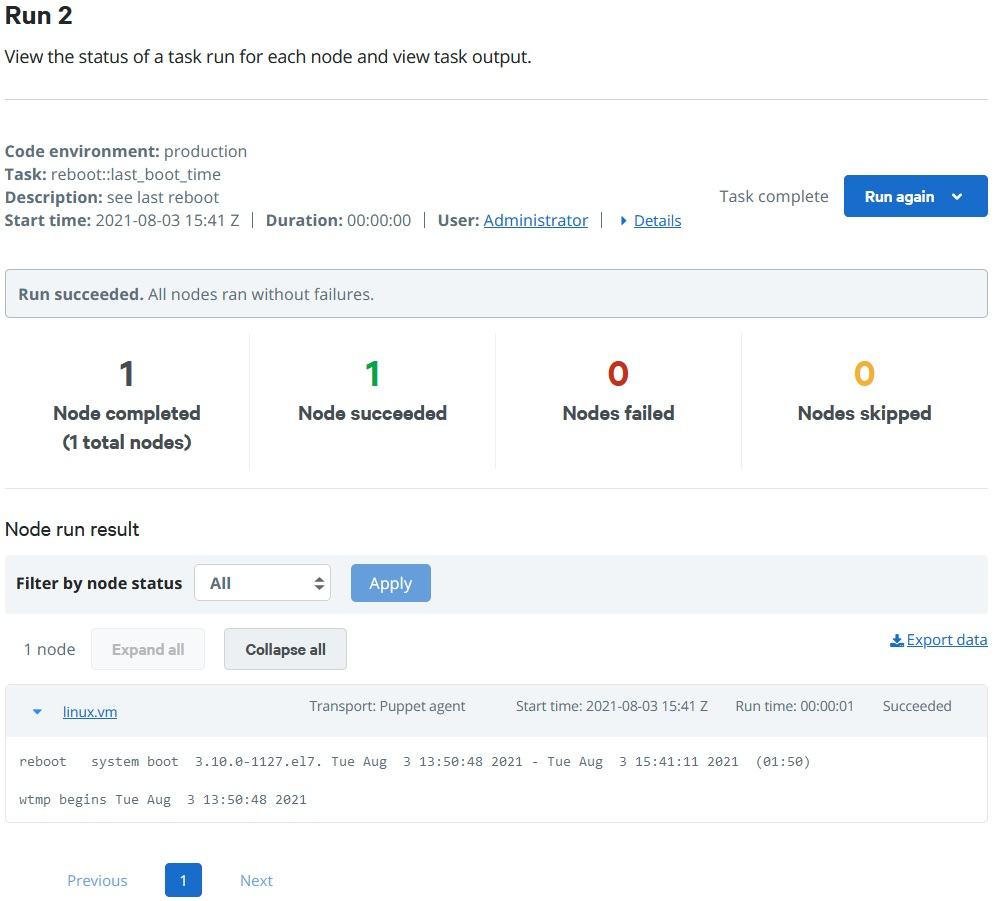
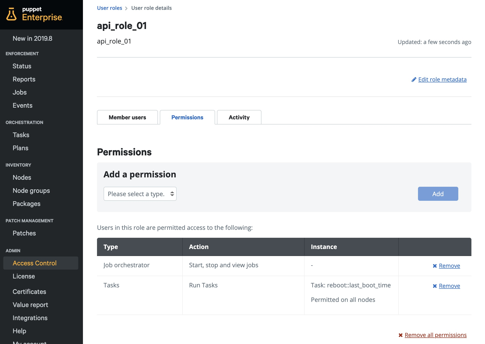
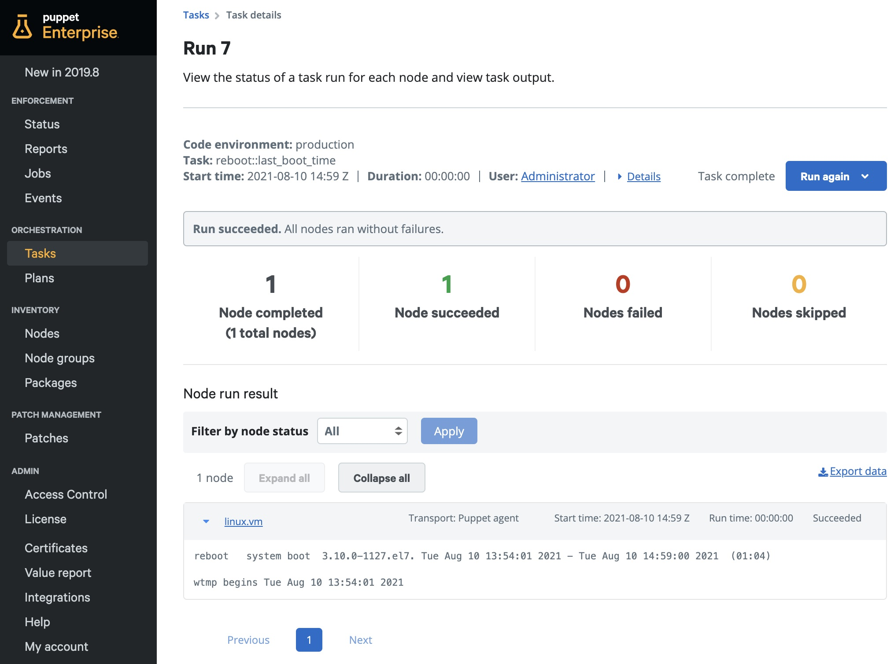

# (1) Agent, Puppet Execution Protocol (PXP)

__"PXP agent extension" enables Puppet users to administer target nodes without the need of SSH or WinRM__

__Time to execute__: approx. 45 minutes to 1 hours (depending on performance)

---
## Synopsis

Puppet Enterprise implements the PXP/PCP agent protocols. __Ad hoc__ or __on-demand__ actions like simple commands, powershell scripts, or ruby code can be executed by Puppet Enterprise without the useage of SSH or WinRM. It is using the default port 8142 connection that the agent opens to the Puppet Enterprise server. The following hands-on tutorial shows fews examples on how to use this, also via API - both RBAC controlled. For a hands-on experience git, vagrant and virtualbox are required to be installed as a prerequisite. Full internet access (no proxy) and a powerful laptop or desktop pc are required.

---
## Start of the virtual machines

```
cd ~
git clone https://github.com/mrcmn/puppet-upandrun
cd puppet-upandrun
```

The following commands will start the machines and install Puppet Enterprise (wait for the primary.vm to finish before you start the linux.vm):

```
vagrant up primary.vm
vagrant up linux.vm
```

After successful installation your Puppet Enterprise instance is available here: [https://192.168.50.4 (admin/puppetlabs)](https://192.168.50.4/) Note: Please be aware that we use self-signed certificates here. You have to include https in the browser address field and accept security warnings.

---
## Topics

Some steps need to be done to run this:

1. [Disable SSH](#1-disable-ssh)
2. [Admin tasks via Puppet Enterprise Console UI](#2-admin-tasks-via-puppet-enterprise-console-ui)
3. [Run tasks via API and RBAC](#3-run-tasks-via-api-and-rbac)

### 1. Disable SSH

Log in to the linux.vm:

```
vagrant ssh linux.vm
sudo bash
cd ~
```

First we disable SSH, because we don't need it:

```
sudo systemctl stop sshd
sudo systemctl disable sshd
exit
```

After exiting from the machine there is no way of going back in. `vagrant ssh linux.vm` should not be working anymore.

### 2. Admin tasks via Puppet Enterprise Console UI

Log in to the Puppet Enterprise Console UI. Navigate to __Orchestration__ > __Tasks__ and click on __Run a task__ in the upper right corner of that window.

For example lets select the task `reboot::last_boot_time` and in the __Select targets__ list we choose __Node list__. Type "vm" into the search field and select the __linux.vm__. At the bottom right of the browser click on __Run task__ to run this task immediately.



In this example the linux.vm from the screenshot above is now active for almost two hours.

That a user is allowed to execute a task like this, three privileges are required:
* Console: view
* Job orchestrator: Start, stop und view jobs
* Tasks: reboot::last_boot_time - for all nodes

The current admin user of course has all of them.

### 3. Run tasks via API and RBAC

Sometimes it might be required to let people execute some tasks, but it is not wanted that they can access the Puppet Enterprise __Console UI__ - or they don't want to. No problem. We can let people control single actions via API. Clicking a button in some kind of self-service portal or a ticket system is enough in this case to start actions.

For example lets create a user that is only allowed to execute the __reboot::last_boot_time task__ via API. In the __Console UI__ navigate to __Administration__ > __Access Control__. Create a new user by typing `api_user_01` into the fields __full name__ and __login__. And click __Add__.

Three settings need to be configured:
1. The user gets privileges via user roles.
2. A password for the user.
3. An access token for this user.

Click on __Manage roles__ to create a new role, name it `api_role_01` and click __Add role__. Click on the role name and navigate to the tab __Member users__. Choose the __api_user_01__ from the list and click __Add user__. Navigate to the tab __Permissions__ and add type __Job orchestrator__ and type __Tasks__ > __Run tasks__ > __reboot::last_boot_time__ - permitted on __all nodes__.



Back to __Administration__ > __Access Control__ and click on __api_user_01__. In the upper right click on __Generate password reset__. Paste the url link into the address field of a new private browser window. On the loaded page: Set the password for the user for example to `password01` and close the browser window. In the terminal cli (of the primary.vm) we now create a token for this user:

```
vagrant ssh primary.vm
```
```
[vagrant@primary ~]$ puppet-access login --lifetime 5h --username api_user_01
Enter your puppet Enterprise credentials.
Password: password01

Access token saved to: /home/vagrant/.puppetlabs/token
[vagrant@primary ~]$ cat /home/vagrant/.puppetlabs/token
0S6uLJxUdQBueNUBSk3S1r9GW80jomxNMy5F6EsdXMhY[vagrant@primary ~]$
```

The token is now valid for the user __api_user_01__ and actions can only be done with the users permissions. Now we can start API calls, for example (running the same task on primary.vm via curl):

```
curl --insecure --header 'X-Authentication: 0S6uLJxUdQBueNUBSk3S1r9GW80jomxNMy5F6EsdXMhY' --header 'Content-Type: application/json' https://192.168.50.4:8143/orchestrator/v1/command/task --data '{"environment": "production", "task" : "reboot::last_boot_time", "params" : {}, "scope" : { "nodes" : ["linux.vm"] }}'
```

The output is in the JSON format:

```
{
  "job" : {
    "id" : "https://192.168.50.4:8143/orchestrator/v1/jobs/7",
    "name" : "7"
  }
}
```

The above output is not the result of the task. We need to request the report that has been created about the task. The job name is important to know for that.

```
curl --insecure --header 'X-Authentication: 0S6uLJxUdQBueNUBSk3S1r9GW80jomxNMy5F6EsdXMhY' https://192.168.50.4:8143/orchestrator/v1/jobs/7/nodes
```

The result again is in JSON formatted:

```
{
  "items" : [ {
    "transport" : "pcp",
    "finish_timestamp" : "2021-08-04T10:45:17Z",
    "transaction_uuid" : null,
    "start_timestamp" : "2021-08-04T10:45:17Z",
    "name" : "linux.vm",
    "duration" : 0.105,
    "state" : "finished",
    "details" : { },
    "result" : {
      "_output" : "reboot   system boot  3.10.0-1127.el7. Wed Aug  4 09:27:10 2021 - Wed Aug  4 10:45:17 2021  (01:18)    \n\nwtmp begins Wed Aug  4 09:27:10 2021\n"
    },
    "latest-event-id" : 20,
    "timestamp" : "2021-08-04T10:45:17Z"
  } ],
  "next-events" : {
    "id" : "https://192.168.50.4:8143/orchestrator/v1/jobs/7/events?start=21",
    "event" : "21"
  },
  "pagination" : {
    "offset" : 0,
    "total" : 1
  }
}%
```

The report can also be found in the __Console UI__. Navigate to __Orchestration__ > __Tasks__ and search for the job number 7 (or the number in your results of the task):



Done!

__Notes__:
* It is reported who executed the task and when.
* The report shows what tasks have been executed.
* The result of that execution is documented.
* Transport "Transport: Puppet agent" in the Console UI or "transport" : "pcp" in the JSON output indicate the use of the PXP agent (or PCP protocol) without the need for SSH.

---
## Summary

Verified:

* Tasks can be run on target nodes via puppet agent without SSH or WinRM.
* The Console UI offers a convenient way to start tasks.
* RBAC can be used to let users only execute certain tasks.
* API is a way to give users capabilities without the need to log in the Console UI.

---
## Additional information

- [www.puppet.com](https://www.puppet.com)

---
## Cleanup

You can now delete this environment after you finished any additional testings by executing the following commands:

```
vagrant destroy primary.vm
vagrant destroy linux.vm
```

You can now delete the puppet-upandrun directory and its content.
