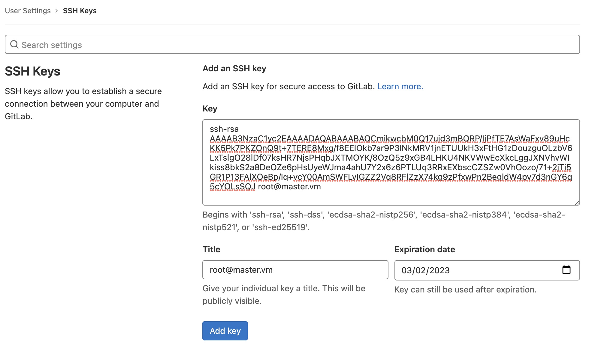
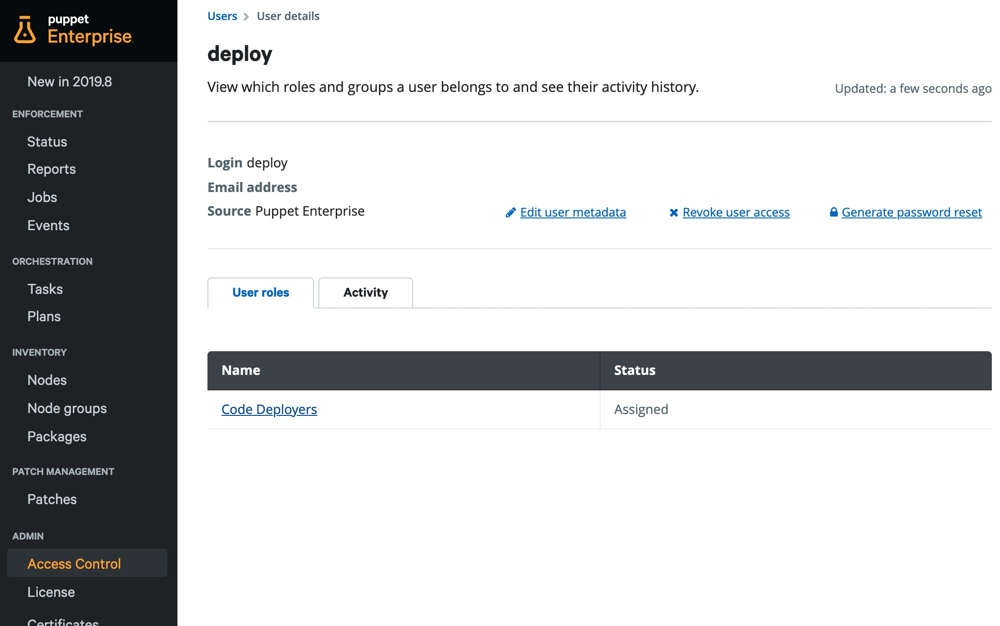
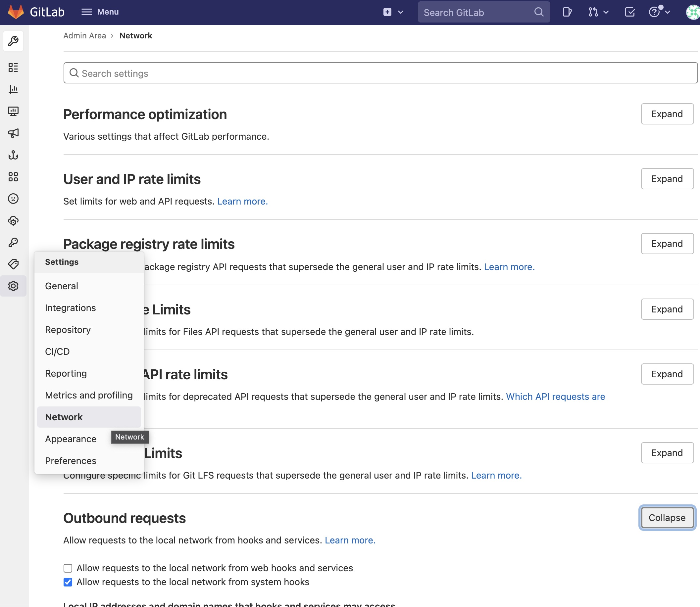
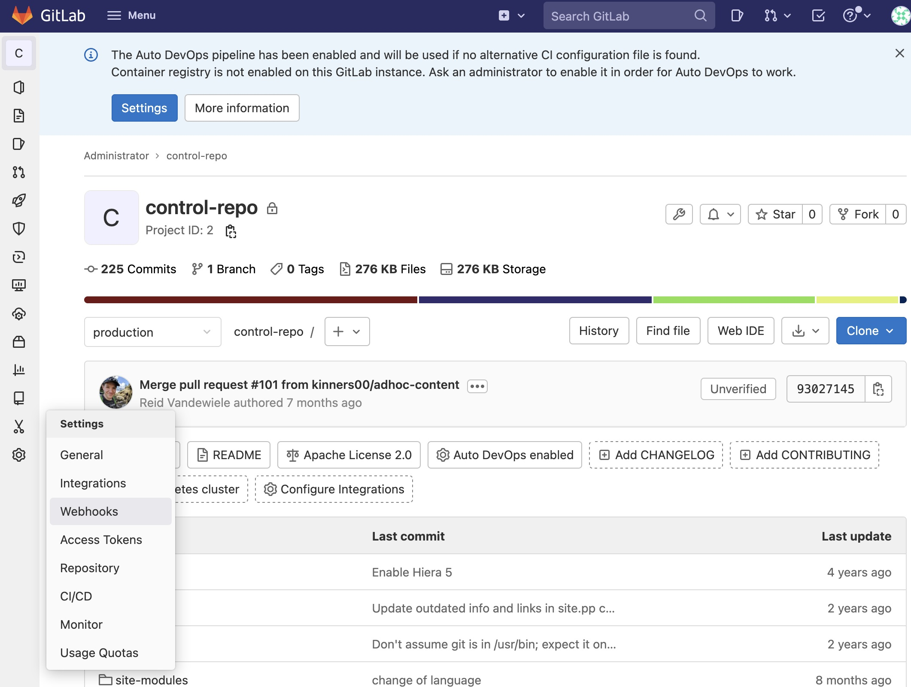

# (2) Code Manager

__Use Code Manager to connect a control repository in git to Puppet Enterprise__

__Time to execute__: approx. 45 minutes to 90 minutes (depending on performance)

---
## Synopsis

It is best practice and strongly recommended to use git to manage a Puppet control repo. Sometimes the official documentation can be a bit confusing with explaining all possible options on various pages to configure Code Manager. The following example is a hands-on tutorial. All instructions are simple copy and paste operations with some additional instructions where necessary. For a hands-on experience git, vagrant and virtualbox are required to be installed as a prerequisite. Full internet access (no proxy) and a powerful laptop or desktop pc are required.

---
## Start of the virtual machines

```
cd ~
git clone https://github.com/mrcmn/puppet-upandrun
cd puppet-upandrun
```

The following commands will start the machines and install Puppet Enterprise:

```
vagrant up primary.vm
```

After successful installation your Puppet Enterprise instance is available here: [https://192.168.50.4 (admin/puppetlabs)](https://192.168.50.4/). __Note__: Please be aware that we use self-signed certificates here. You have to include https in the browser address field and accept security warnings.

Now start the gitlab vm:

```
vagrant up gitlab.vm
```

The gitlab instance can be accessed here: [http://192.168.50.7 (root/puppetlabs)](http://192.168.50.7).

---
## Content

Some steps need to be done to run this:

1. [Create SSH keys](#1-create-ssh-keys) to let Puppet manage the control repo.
2. [Create control repo from template](#2-create-control-repo)
3. [Configure Code Manager](#3-configure-code-manager) and let Puppet Enterprise deploy new code
4. [Webhook in Gitlab](#4-webhook-in-gitlab) configured to initiate code deploy for push or commit events
5. [Final test](#5-final-test)

### 1. Create SSH keys

Log in to the primary.vm:

```
vagrant ssh primary.vm
sudo bash
cd ~
```

Then create the keys, it is not so important for this example what you type in the input fields:

```
ssh-keygen -t rsa -b 2048 -P '' -f /etc/puppetlabs/puppetserver/ssh/id-control_repo.rsa
```

Following lets Puppet Enterprise use the keys:

```
puppet infrastructure configure
```

Now we can add the key to the git user. Take (copy) the output of the following command:

```
cat /etc/puppetlabs/puppetserver/ssh/id-control_repo.rsa.pub
```

The output looks similar to this:

```
ssh-rsa AAAAB3NzaC1yc2EAAAADAQABAAABAQCmikwcbM0Q17ujd3mBQRP/IjPfTE7AsWaFxv89uHcKK5Pk7PKZOnQ9t+7TERE8Mxg/f8EEIOkb7ar9P3lNkMRV1jnETUUkH3xFtHG1zDouzguOLzbV6LxTslgO28lDf07ksHR7NjsPHqbJXTMOYK/8OzQ5z9xGB4LHKU4NKVWwEcXkcLggJXNVhvWIkiss8bkS2a8DeOZe6pHsUyeWJma4ahU7Y2x6z6PTLUq3RRxEXbscCZSZw0VhOozo/71+2jTi5GR1P13FAlXOeBp/Iq+vcY00AmSWFLyIGZZ2Vq8RFlZzX74kg9zPfxwPn2BegldW4pv7d3nGY6q5cYOLsSQJ root@primary.vm
```

Connect to the gitlab instance with the root user: [http://192.168.50.7 (root/puppetlabs)](http://192.168.50.7).

Click on the user menu in the upper right, then select __Preferences__. In the left menu now click on __SSH Keys__. Add the key by pasting the above output into the Key field, set a __title__ and an __Expiration date__. Klick __Add key__.



We can now test the connection. In the terminal window on the primary.vm execute the following ssh command:

```
[root@primary ssh]# ssh -T -i /etc/puppetlabs/puppetserver/ssh/id-control_repo.rsa git@192.168.50.7
...
Welcome to GitLab, @root!
[root@primary ssh]#
```

### 2. Create control repo

To create a control repository, we can use the template from puppet. We don't use a separate client. So we use the root home directory on the primary.vm as a client where changes in the control repo will be edited and pushed in the gitlab.vm. From here we want gitlab to use the webhook to update the control repo on the Puppet Enterprise server.

As root we install git on the primary.vm:

```
cd ~
yum install git
```

Then we can take the template and push it into our own git repository:

```
mkdir repo
cd repo
git clone https://github.com/puppetlabs/control-repo.git
cd control-repo
git remote remove origin
git remote add origin git@192.168.50.7:root/control-repo.git
git config --global user.name "root"
git config --global user.email "my@user-email.com"

eval `ssh-agent -s`
ssh-add /etc/puppetlabs/puppetserver/ssh/id-control_repo.rsa

git checkout -b production
git push origin production
```

__Note__: eval and ssh commands are needed because we did not configure ssh with the key. Both need to be executed again, if the shell is closed and reopened later.

### 3. Configure Code Manager

In the Puppet Console UI navigate to __Node groups__ > "PE Master" to the __Classes__ tab. In the class `puppet_enterprise::profile::primary` we add the following parameters:
* r10k_private_key = `"/etc/puppetlabs/puppetserver/ssh/id-control_repo.rsa"`
* r10k_remote = `"git@192.168.50.7:root/control-repo.git"`
* code_manager_auto_configure = `true`
* replication_mode = `"none"`

To immediately apply the changes, we execute:

```
[root@peserver ~]# puppet agent -t
```

Then we need to create a user `deploy`. Add the new users to the user role __Code Deployers__.



In the settings for the deploy user click on the __Generate password reset__ link in the upper right (as seen in the screenshot above). Use the link in a different browser or a new private browser window and set the password to `puppetlabs`.

Now the deploy user needs a token. In the shell:

```
[root@primary control-repo]# puppet access login --lifetime 360d
Enter your Puppet Enterprise credentials.
Username: deploy
Password: puppetlabs

Access token saved to: /root/.puppetlabs/token

[root@primary control-repo]#
```

And test the connection:

```
[root@primary control-repo]# puppet-code deploy --dry-run
--dry-run implies --all.
--dry-run implies --wait.
Dry-run deploying all environments.
Found 0 environments.
Found 1 environments.
[
  {
    "environment": "production"
  }
]
[root@primary control-repo]#
```

The above output shows success. We can now run a deployment:

```
puppet-code deploy production --wait
```

After few moments the files on the Puppet Enterprise primary server should be updated with the content of the template control repo from our repo in the gitlab.vm:

```
ls -la /etc/puppetlabs/code/environments/production
```

### 4. Webhook in Gitlab

Now we still need to configure this update automatically with a webhook. In our environment, we have to make sure that webhooks are allowed to be executed to local addresses. For security reasons this is deactivated by default.

In the gitlab web ui click on the __Admin Area__ in the main menu (or "Burger menu"). Select __Settings__ > __Network__ (/admin/application_settings/network). Activate "Allow requests to the local network from web hooks and services" and save the change.



Now take the token from the deploy user:

```
cat /root/.puppetlabs/token
```

__Note__: If you have created a token for another user meanwhile, that the above file gets overwritten with the other token.

This is an example webhook for this tutorial, but you have to replace the token (at the end) with the token from your instance.

```
https://192.168.50.4:8170/code-manager/v1/webhook?type=gitlab&token=0BUn0AtofD_w8P9s0-SJZohtyNtMQRDYx4_ERKJuDxlE
```

Go to the gitlab web ui to the control repo. Select in the left menu __Settings__ > __Webhooks__.



Paste the webhook there in the input and __disable__ "Enable SSL verification" and click __Add webhook__. The hook appears below on the page. Click on __Test__ > __Push events__. On success "Hook executed successfully: HTTP 200" is displayed at the top of the page.

__Note__: The config of webhooks might slightly differ depending on what git you use. In example for github, you also have to make sure the the webhook uses json as payload data format.

### 5. Final test

For testing the complete functionality, we need to change something the the control repo: For example edit the Puppetfile.

```
[root@primary ]# cd ~/repo/control-repo
[root@primary control-repo]# echo '# some changes' >> Puppetfile
```

After something has changed, and pushing it into the git repository ...

```
git add Puppetfile
git commit -m "updated Puppetfile config"
git push origin production
```

... we can see after few moments, that the content of the production environment of Puppet Enterprise has been updated:

```
cat /etc/puppetlabs/code/environments/production/Puppetfile
```

Verify that the above file contains your changes. Done!

---
## Summary

Verified:

* Installed a puppet control repository from template.
* Configured Code Manager and a webhook.
* Tested automatic code deployment after updating the repository.

---
## Additional information

- [www.puppet.com](https://www.puppet.com)
- [Puppet docs about Code Manager](https://puppet.com/docs/pe/2021.6/code_mgr.html)

---
## Cleanup

You can now delete this environment after you finished any additional testings by executing the following commands:

```
vagrant destroy primary.vm
vagrant destroy gitlab.vm
```

You can now delete the puppet-upandrun directory and its content.
