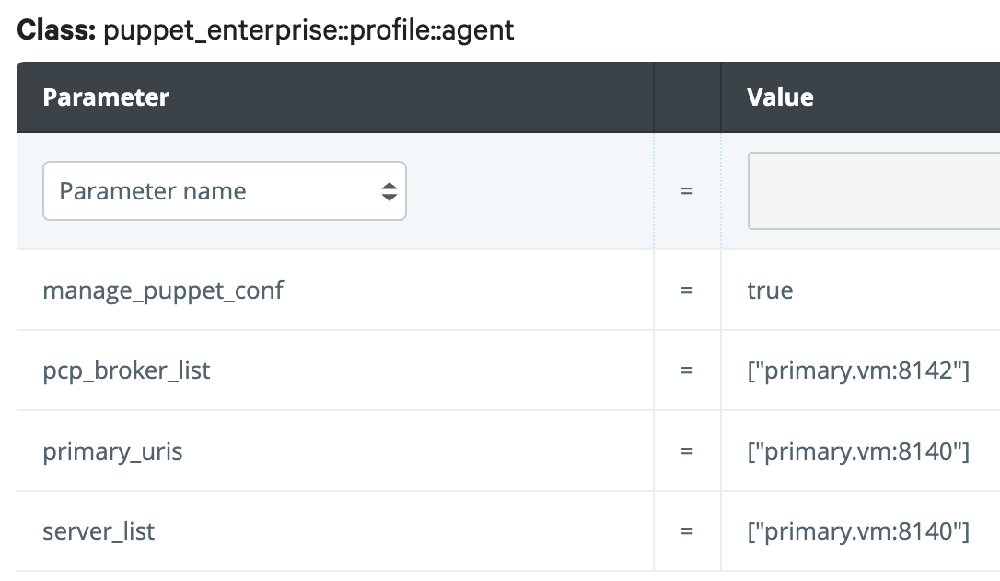

# (3) Failover Disaster Recovery

__Setup of a Puppet Enterprise replica server for failover in case of the loss of the primary server.__

__Time to execute__: approx. up to 3 hours (depending on performance and experience)

---
## Synopsis

This is not a high availability setup. The Puppet Enterprise replica server lets you have a separate failover system in place that can - like Compiler - repsond to agent requests any time. But it should not be considered to use it for that in normal workload situations unless it is sized for that workload even in a failover scenario. This hands-on exercise is perfect to try disaster recovery failover to learn how it works and what is neccessary to use it.

For a hands-on experience git, vagrant and virtualbox are required to be installed as a prerequisite. Full internet access (no proxy) and a powerful laptop or desktop pc are required. This is a longer exercise because also gitlab.vm needs to be installed an configured. This exercise also includes the Code Manager tutorial or this exercise can be used as an extension of the Code Manager tutorial.

---
## Start of the virtual machines

```
cd ~
git clone https://github.com/mrcmn/puppet-upandrun
cd puppet-upandrun
```

The following commands will start the machines and install Puppet Enterprise. Please start virtual machines in this order and wait for the previous vm to start completely:

```
vagrant up primary.vm
vagrant up replica.vm
vagrant up linux.vm
vagrant up gitlab.vm
```

After successful installation your Puppet Enterprise instance is available here: [https://192.168.50.4 (admin/puppetlabs)](https://192.168.50.4/) __Note__: Please be aware that we use self-signed certificates here. You have to include https in the browser address field and accept security warnings.

---
## The plan

This tutorial uses a running and connected git repository. Step by step process:

1. [Install Gitlab and configure Code Manager](#1-code-manager-config)
2. [Settings for Primary and Replica](#2-settings-for-primary-and-replica)
3. [Activate Replica](#3-activate-replica)
4. [Test Failover](#4-test-failover)
5. [Promote Replica to be the new Primary](#5-promote-replica)

### 1. Code Manager config

Please follow the [this link and run through the setup sections 1 to 5](02-codemanager-config.md#1-create-ssh-keys) to install and configure gitlab and Code Manager. After that is done, come back to this point and proceed with the following.

### 2. Settings for Primary and Replica

The admin user has not received tokens yet. Assuming that you are using the terminal window being on your laptop, do the following:

```
cd ~/puppet-upandrun
vagrant ssh primary.vm
sudo bash
cd ~
```

The following creates a token for the admin:

```
[root@primary ~]# puppet access login --lifetime 360d
Enter your Puppet Enterprise credentials.
Username: admin
Password: puppetlabs

Access token saved to: /root/.puppetlabs/token
[root@primary ~]#
```

In the Puppet Enterprise Console UI navigate to Node Groups > "PE Infrastructure Agent" and in the Classes tab look for the class "puppet_enterprise::profile::agent". Check for the following parameters:

* manage_puppet_conf = `true`
* pcp_broker_list = `["primary.vm:8142"]`
* primary_uris = `["primary.vm:8140"]`
* server_list = `["primary.vm:8140"]`

In the end it should look like this (should be the status that is already set):



### 3. Activate Replica

Until now, the replica.vm is just having a normal puppet agent installed. We provision a replica and then all needed components will be installed by the agent. Execute the following:

```
[root@primary ~]# puppet infrastructure provision replica replica.vm --enable
```

We will provide `A` for 'Monolithic with a single primary' and `Y` for 'Use the new configuration and continue enabling the replica by running puppet on all infrastructure nodes?'. Then we can wait for the installer to finish.

After the installation is done we need to copy a key to the replica server. Here we copy & paste the key.

```
[root@primary ~]# cat /etc/puppetlabs/orchestration-services/conf.d/secrets/keys.json
[{"key":"AM_zdeUO39yO3OYYTTPJAGqIh8Jf47NqLmcZ0Wee9cqVrTabwrEO_NyO8n8Hk54KqxKGm4zCUioZPknac17VjIg","id":"f3afbb4b-00c2-4c15-8587-29d3709b4f96"}][root@primary ~]#
```
```
exit
```

Of course the key will be different in your environment. The content need to be replaced in the following instructions. The key has to be created in the same directory with same permissions on the replica server:

```
vagrant ssh replica
[vagrant@replica ~] sudo bash

[root@replica ~]# mkdir -p /etc/puppetlabs/orchestration-services/conf.d/secrets/

[root@replica ~]# echo '[{"key":"AM_zdeUO39yO3OYYTTPJAGqIh8Jf47NqLmcZ0Wee9cqVrTabwrEO_NyO8n8Hk54KqxKGm4zCUioZPknac17VjIg","id":"f3afbb4b-00c2-4c15-8587-29d3709b4f96"}]' > /etc/puppetlabs/orchestration-services/conf.d/secrets/keys.json

[root@replica ~]# chmod 640 /etc/puppetlabs/orchestration-services/conf.d/secrets/keys.json
[root@replica ~]# chown pe-orchestration-services:pe-orchestration-services /etc/puppetlabs/orchestration-services/conf.d/secrets/keys.json

[root@replica ~]# ls -la /etc/puppetlabs/orchestration-services/conf.d/secrets/
total 4
drwxr-xr-x. 2 root root  23 Aug 15 14:18 .
drwxr-xr-x. 3 root root 105 Aug 15 14:14 ..
-rw-r-----. 1 pe-orchestration-services pe-orchestration-services 143 Aug 15 13:08 keys.json
[root@replica ~]#
```

__Note__: It is important that the key file is readable and owned by the user __pe-orchestration-services__.

After the installation is done, run this command on the primary server to execute an agent run on all nodes:

```
[root@primary ~]# puppet job run --no-enforce-environment --query 'nodes {deactivated is null and expired is null}'
```

Done! All activities will now be replicated to the replica.vm.

### 4. Test Failover

1. Test if all services are active

```
[root@primary ~]# puppet infrastructure status --verbose
```

Everything should be in a green state.

2. Test that agents can connect to both systems primary and replica server

On the linux.vm node execute an agent run against the replica:

```
[root@linux vagrant]# puppet agent -t --noop --server_list=replica.vm
Info: Using environment 'production'
Info: Retrieving pluginfacts
Info: Retrieving plugin
Info: Loading facts
Info: Applying configuration version 'replica-production-240d5f61db0'
Notice: Applied catalog in 0.05 seconds
[root@linux vagrant]#
```

And now against the primary:

```
[root@linux vagrant]# puppet agent -t --noop
Info: Using environment 'production'
Info: Retrieving pluginfacts
Info: Retrieving plugin
Info: Loading facts
Info: Applying configuration version 'primary-production-240d5f61db0'
Notice: Applied catalog in 0.04 seconds
[root@linux vagrant]#
```

Both commands should have a similar output as above.

3. Test that changes are replicated to the replica.vm

A little change to the control repo. As created in the Code Manager tutorial explained, we change control repo content in the home directory of the root-user on the primary.vm:

```
[root@primary ~]# cd /root/repo/control-repo
```

If the shell session to the primary was closed since setting up the gitlab.vm and now, the following needs to be done on the primary (also execute the commands if you don't remember if it is the same shell session):

```
eval `ssh-agent -s`
ssh-add /etc/puppetlabs/puppetserver/ssh/id-control_repo.rsa
```

Then the change can be applied:

```
[root@primary control-repo]# echo '# some changes' >> Puppetfile

[root@primary control-repo]# git add Puppetfile

[root@primary control-repo]# git commit -m "updated Puppetfile config update"
[production 9f6c588] updated Puppetfile config update
 1 file changed, 1 insertion(+)

[root@primary control-repo]# git push origin production
Counting objects: 5, done.
Delta compression using up to 2 threads.
Compressing objects: 100% (3/3), done.
Writing objects: 100% (3/3), 306 bytes | 0 bytes/s, done.
Total 3 (delta 2), reused 0 (delta 0)
To git@192.168.50.7:root/control-repo.git
   240d5f6..9f6c588  production -> production
[root@primary control-repo]#
```

Now the changes have been pushed to the gitlab instance. After a few seconds we can see on the replica server:

```
[root@replica ~]# cd /etc/puppetlabs/code/environments/production/
[root@replica production]# cat Puppetfile
```

The output of cat shows: The Puppetfile contains all changed settings from above. This is the proof that agents will receive the updated definitions when connecting to the replica.

4. Test failover

To test the failover we can now just shut down the primary.vm:

```
vagrant halt primary.vm
```

Now the primary puppet server is down. We can log into the linux node to see what an agent run does:

```
[root@linux vagrant]# puppet agent -t --noop
Warning: Unable to connect to server from server_list setting: Request to https://primary.vm:8140/status/v1/simple/server failed after 0.003 seconds: Failed to open TCP connection to primary.vm:8140 (Connection refused - connect(2) for "primary.vm" port 8140) Trying with next server from server_list.
Info: Using environment 'production'
Info: Retrieving pluginfacts
Info: Retrieving plugin
Info: Loading facts
Info: Applying configuration version 'replica-production-9f6c5881a8e'
Notice: Applied catalog in 0.06 seconds
[root@linux vagrant]#
```

The agent first tries to contact the primary. As the primary puppet server is not available it connects to the replicas. After the primary is available again `vagrant halt primary.vm`, then the agents connect automatically to the primary again:

```
[root@linux vagrant]# puppet agent -t --noop
Info: Using environment 'production'
Info: Retrieving pluginfacts
Info: Retrieving plugin
Info: Loading facts
Info: Applying configuration version 'primary-production-9f6c5881a8e'
Notice: Applied catalog in 0.05 seconds
[root@linux vagrant]#
```

Verified that the failover works!

__Notes__:
* Who tried to access to the web console of the replica.vm has noticed that this has not been installed yet.
* During the failover only the following are available:
  * Scheduled Puppet Runs
  * Catalog compilation
  * Viewing classification data using the node classifier API
  * Reporting and queries based on PuppetDB data
* Following features are not available:
  * update Puppet code
  * Editing node classifier data
  * Web Console UI
  * Certificate functions and adding new agents
  * most CLI tools
* Full functionality on replica.vm will only be available after a promotion of the replica to the new primary server.


### 5. Promote Replica

After the Puppet Enterprise primary server is completely lost and can not be recovered, the replica server can be promoted to be the new primary. In this case additional steps are required:

```
vagrant destroy primary.vm
```

Now the primary is gone. The replica will be promoted:

```
[root@replica ~]# puppet infrastructure promote replica
```

Installation processes will be running for a while. After that is done Puppet Enterprise is running again - the new primary is now the replica.vm - and can be accessed here: [https://192.168.50.41 (admin/puppetlabs)](https://192.168.50.41).

Further configurations will be neccessary: The Code Manager config is not running and needs to be corrected or done from scratch again.

Done!

---
## Summary

Verified:

* agents can connect to primary and replica server
* all changes are replicated from primary to the replica server
* failover scenarios tested where agents connect to the replica
* replica can be promoted to the new primary

---
## Additional information

- [www.puppet.com](https://www.puppet.com)
- [Disaster recovery in the puppet docs](https://puppet.com/docs/pe/2021.7/dr_overview.html)

---
## Cleanup

You can now delete this environment after you finished any additional testings by executing the following commands:

```
vagrant destroy primary.vm
vagrant destroy replica.vm
vagrant destroy linux.vm
vagrant destroy gitlab.vm
```

You can now delete the puppet-upandrun directory and its content.
