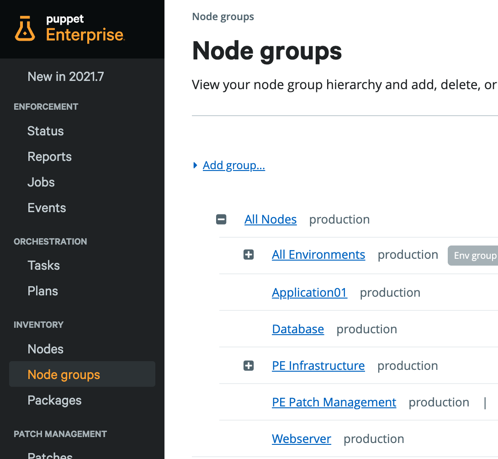
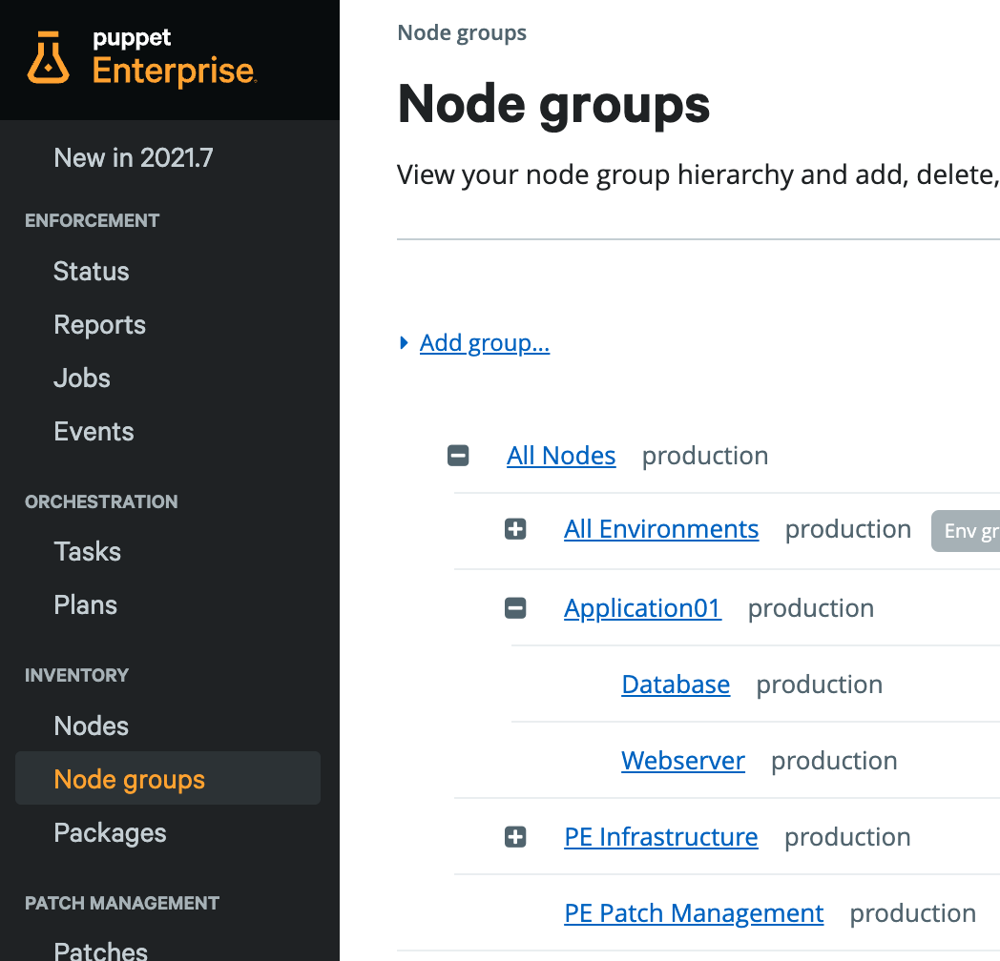

# (5) Node Groups as-Code

__Manage Node Groups in Puppet Enterprise via REST API and via puppet module as-Code__

__Time to execute__: approx. 30 minutes to 60 minutes (depending on performance)

---
## Synopsis

This tutorial covers "**Node Groups as Code**" to illustrate how Node Groups from the **Console UI** of **Puppet Enterprise** can be managed via git repository. To keep this exercise as easy as possible, we create few examples via CLI and files without the (in "normal" cases) recommended git instance.

---
## Start of the virtual machine

```
cd ~
git clone https://github.com/mrcmn/puppet-upandrun
cd puppet-upandrun
```

The following commands will start Puppet Enterprise:

```
vagrant up primary.vm
```

After successful installation your Puppet Enterprise instance is available here: [https://192.168.50.4 (admin/puppetlabs)](https://192.168.50.4/) __Note__: Please be aware that we use self-signed certificates here. You have to include https in the browser address field and accept security warnings.

---
## Manage Node Groups outside the Console UI

Some steps and examples:

1. [Create a token for the API calls](#1-create-a-token-for-the-api-calls)
2. [Prettify the output with jq](#2-prettify-the-output-with-jq)
3. [Manage Node Groups via REST API](#3-manage-node-groups-via-rest-api)
4. [Group Enforcement: Node Groups as-Code](#4-group-enforcement-node-groups-as-code)

All commands will be executed on the __primary.vm__ as __root__ user in their user __home__ directories. Connect to the primary.vm:

```
vagrant ssh primary.vm
sudo bash
cd ~
```

### 1. Create a token for the API calls

Create the token:

```
curl -s -S -k -X POST -H 'Content-Type: application/json' -d '{"login": "admin", "password": "puppetlabs"}' https://192.168.50.4:4433/rbac-api/v1/auth/token | sed 's/{"token":"\(.*\)"}/\1/g'
```

In my instance the token `AKHlHp8PZt4uVzDs9MqI1mKED1thL3Wjw7zriLldUSHQ` is displayed as result. In the following examples replace this token with your own token when you want to follow this tutorial hands-on. With this token we now can run all commands. __Note__: It also is possible to authenticate via certificate, if required. See the docs for more info: [Node classifier API authentication](https://www.puppet.com/docs/pe/2021.7/forming_node_classifier_requests.html#authenticating_to_the_node_classifier_api).

Let's now for example display all Node Groups:

```
curl --insecure "https://192.168.50.4:4433/classifier-api/v1/groups?token=AKHlHp8PZt4uVzDs9MqI1mKED1thL3Wjw7zriLldUSHQ"
```

Or in a different format:

```
curl -s -S -k -X GET -H 'Content-Type: application/json' -H "X-Authentication: AKHlHp8PZt4uVzDs9MqI1mKED1thL3Wjw7zriLldUSHQ" https://192.168.50.4:4433/classifier-api/v1/groups
```

### 2. Prettify the output with jq

Use of **sed** to prettify the output would not be very efficient. So we use the [JSON processer __jq__](https://stedolan.github.io/jq/manual/).

```
yum install epel-release -y

yum install jq -y
```

After sucessful installation we can see the version number here:

```
rpm -qa | grep -i jq
```

Result in my instance is version number `jq-1.6-2.el7.x86_64`. Here are a few easy examples, to see how jq works:

```
[root@primary ~]# echo '{"foo": 0, "bar": 1}' | jq .
{
  "foo": 0,
  "bar": 1
}
[root@primary ~]# echo '{"foo": 0, "bar": 1}' | jq .bar
1
[root@primary ~]# echo '{"foo": {"eins":"one","zwei":"two"}, "bar": 1}' | jq .foo.eins
"one"
[root@primary ~]#
```

### 3. Manage Node Groups via REST API

We can now use __jq__ to run more examples with easier to read outputs:

```
[root@primary vagrant]# curl -s -S -k -X GET -H 'Content-Type: application/json' -H "X-Authentication: AKHlHp8PZt4uVzDs9MqI1mKED1thL3Wjw7zriLldUSHQ" https://192.168.50.4:4433/classifier-api/v1/groups 2>&1 | jq .[].name
"All Nodes"
"Production environment"
"PE Console"
"PE Master"
"PE Infrastructure"
"PE Compiler"
"PE Orchestrator"
"PE Agent"
"PE PuppetDB"
"PE Patch Management"
"PE Infrastructure Agent"
"Development environment"
"Development one-time run exception"
"All Environments"
"PE Certificate Authority"
"PE Database"
[root@primary vagrant]#
```

Or iterate over the array to concat the fields name and parent:

```
curl -s -S -k -X GET -H 'Content-Type: application/json' -H "X-Authentication: AKHlHp8PZt4uVzDs9MqI1mKED1thL3Wjw7zriLldUSHQ" https://192.168.50.4:4433/classifier-api/v1/groups 2>&1 | jq '.[] | .name + "   " + .parent'
"All Nodes   00000000-0000-4000-8000-000000000000"
"Production environment   e2954573-bc88-470e-a349-3559e3277d65"
"PE Console   63801c3e-6f62-4c78-8b02-86802b3b203c"
"PE Master   63801c3e-6f62-4c78-8b02-86802b3b203c"
"PE Infrastructure   00000000-0000-4000-8000-000000000000"
"PE Compiler   55498d40-621e-4bba-b3a4-04c8a67ebaf0"
"PE Orchestrator   63801c3e-6f62-4c78-8b02-86802b3b203c"
"PE Agent   63801c3e-6f62-4c78-8b02-86802b3b203c"
"PE PuppetDB   63801c3e-6f62-4c78-8b02-86802b3b203c"
"PE Patch Management   00000000-0000-4000-8000-000000000000"
"PE Infrastructure Agent   8acf9124-9368-45d1-a45d-8a4ae6ad05e9"
"Development environment   e2954573-bc88-470e-a349-3559e3277d65"
"Development one-time run exception   c005d10c-a922-4f7a-9836-29c7a7613b41"
"All Environments   00000000-0000-4000-8000-000000000000"
"PE Certificate Authority   63801c3e-6f62-4c78-8b02-86802b3b203c"
"PE Database   63801c3e-6f62-4c78-8b02-86802b3b203c"
```

Let's create a new Node Group, for example the Node Group "testserver":

```
curl -s -S -k -X PUT -H 'Content-Type: application/json' -H "X-Authentication: AKHlHp8PZt4uVzDs9MqI1mKED1thL3Wjw7zriLldUSHQ" -d "{ \"name\": \"testserver\",\"parent\": \"00000000-0000-4000-8000-000000000000\", \"environment\": \"production\", \"classes\": {} }" https://192.168.50.4:4433/classifier-api/v1/groups/00000000-2112-4000-8000-000000000012
```

The success of this can also be seen in the Console UI under Node Groups. But here this is starting to become a bit ugly due to all the escape characters we need.

### 4. Group Enforcement: Node Groups as-Code

We want to use a puppet modules to manage - and enforce - our group configurations. Without git repository, we have to install the module manually:

```
puppet module install WhatsARanjit-node_manager --version 0.7.5
```

__Note__: If you are using a git repository, like the gitlab.vm that is included in this repository, then just add `mod 'WhatsARanjit-node_manager', '0.7.5'` at the bottom of the file __control-repo/Puppetfile__.

After successful installation of the node_manager module, let's run:

```
[root@primary ~]# puppet resource node_group 'testserver'
node_group { 'testserver':
  ensure               => 'present',
  environment          => 'production',
  id                   => '00000000-2112-4000-8000-000000000012',
  override_environment => 'false',
  parent               => 'All Nodes',
  provider             => 'https',
  rule                 => [''],
}
[root@primary ~]#
```

The above output is a very good example what parameters are needed to manage Node Groups. To create Node Groups we can use the example, but we don't have to care about the __id__ field. Also the empty __rule__ field is not needed to create groups.

To keep this simple, we just add the following lines to the file __site.pp__ which is located here: `/etc/puppetlabs/code/environments/production/manifests/site.pp`

__Note__: In a git control repo, the site.pp can be found here: __control-repo/manifests/site.pp__

```
node 'primary.vm' {
 node_group { 'Webserver':
   ensure               => 'present',
   environment          => 'production',
   override_environment => 'false',
   parent               => 'All Nodes',
   provider             => 'https',
 }
 node_group { 'Database':
   ensure               => 'present',
   environment          => 'production',
   override_environment => 'false',
   parent               => 'All Nodes',
   provider             => 'https',
 }
 node_group { 'Application01':
   ensure               => 'present',
   environment          => 'production',
   override_environment => 'false',
   parent               => 'All Nodes',
   provider             => 'https',
 }
}
```

To immediately make this change happen we execute an agent run on the __primary.vm__:

```
puppet agent -t
```

In the Puppet Enterprise __Consule UI__ we can now see the three new groups:



Changes can be managed in the same way. Let's group the Node Groups __Webserver__ and __Database__ as subgroups of the Node Group __Application01__. So to achieve this we change the parent field in the above config like this:

```
node 'primary.vm' {
 node_group { 'Webserver':
   ensure               => 'present',
   environment          => 'production',
   override_environment => 'false',
   parent               => 'Application01',
   provider             => 'https',
 }
 node_group { 'Database':
   ensure               => 'present',
   environment          => 'production',
   override_environment => 'false',
   parent               => 'Application01',
   provider             => 'https',
 }
 node_group { 'Application01':
   ensure               => 'present',
   environment          => 'production',
   override_environment => 'false',
   parent               => 'All Nodes',
   provider             => 'https',
 }
}
```

At the agent run, you will see something like this:

```
[root@primary ~]# puppet agent -t
Info: Using environment 'production'
Info: Retrieving pluginfacts
Info: Retrieving plugin
Info: Loading facts
Info: Caching catalog for primary.vm
Info: Applying configuration version 'primary-production-48fc728f705'
Notice: /Stage[main]/Main/Node[primary.vm]/Node_group[Webserver]/parent: parent changed 'All Nodes' to 'Application01'
Notice: /Stage[main]/Main/Node[primary.vm]/Node_group[Database]/parent: parent changed 'All Nodes' to 'Application01'
Notice: Applied catalog in 28.79 seconds
[root@primary ~]#
```

In the Puppet Enterprise __Console UI__ we can now see the new hierarchical grouping within __Application01__:



The above examples are very easy. But also more complex definitions can be made like __Rules__ and __Classes__. If you are wondering about which syntax to use, you can configure an example via Console UI and then export the definition to see how it is done. The following example shows a group definition that includes a class with two parameters and a rule that groups automatically nodes with a certain name:

```
[root@primary ~]# puppet resource node_group 'Patch_Linux'
node_group { 'Patch_Linux':
  ensure               => 'present',
  classes              => {
  'pe_patch' => {
    'blackout_windows' => {
      'End of year change freeze' => {
        'end' => '2023-01-15T23:59:59+10:00',
        'start' => '2022-12-15T00:00:00+10:00'
      }
    },
    'patch_group' => 'PG_Linux'
  }
},
  description          => 'this group contains patch management for linux systems',
  environment          => 'production',
  id                   => '8b5524c7-0c22-40c4-bfab-91a92ab4517e',
  override_environment => 'false',
  parent               => 'PE Patch Management',
  provider             => 'https',
  rule                 => ['and',
  ['~',
    ['fact', 'hostname'],
    'nux']],
}
[root@primary ~]#
```

If you want to try this, then just delete the id field and include the rest into the site.pp like above. Done!

---
## Summary

Verified:

* used __REST API__ to see Node Group information and to create a Node Group
* saw how to create and change node group definitions via puppet module __Node_Manager__ ... as Code

---
## Additional information

- [www.puppet.com](https://www.puppet.com)

---
## Cleanup

You can now delete this environment after you finished any additional testings by executing the following commands:

```
vagrant destroy primary.vm
```

You can now delete the puppet-upandrun directory and its content.
