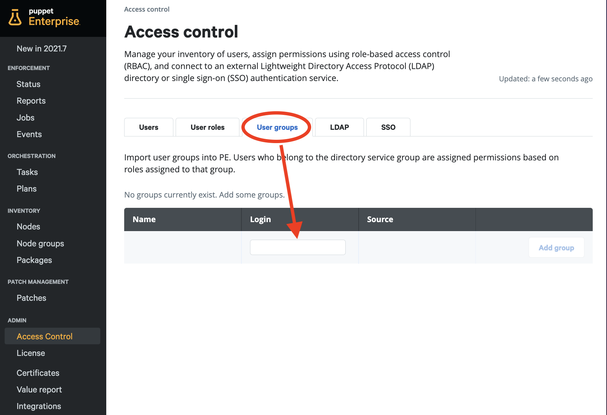
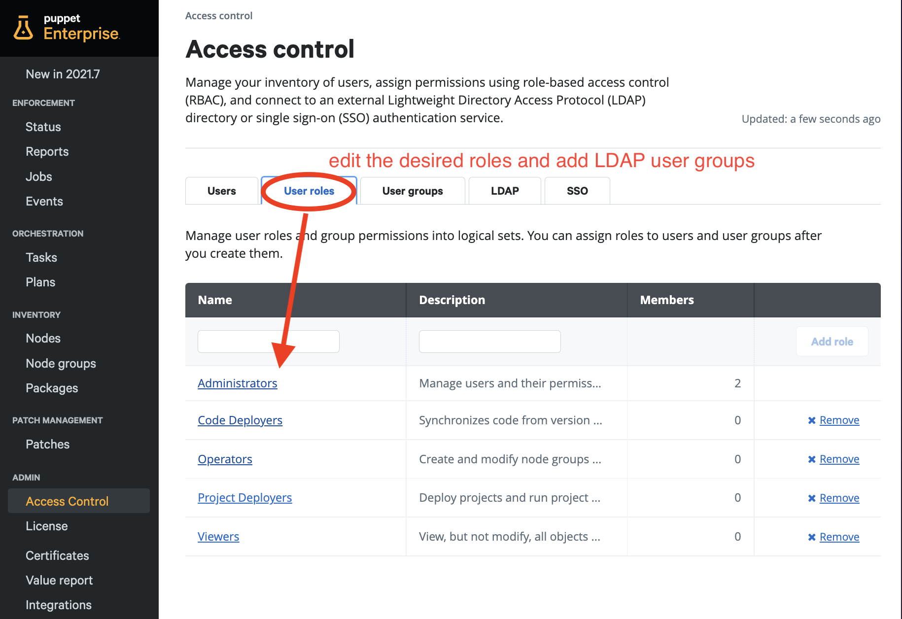

# (6) LDAP

__Authenticate and authorize Puppet Enterprise Console users via LDAP.__

__Time to execute__: approx. 45 minutes to 2 hours (depending on performance)

---
## Synopsis

This hands-on exercise covers installation and configuration of Puppet Enterprise and OpenLDAP. It shows the use of LDAP groups with RBAC in Puppet Enterprise. Two users (Jane and John) will be created in LDAP and can be authenticated and authorized via LDAP and Puppet RBAC to the Puppet Enterprise Console UI. All instructions are simple copy and paste operations with some additional instructions where necessary. For a hands-on experience git, vagrant and virtualbox are required to be installed as a prerequisite. Full internet access (no proxy) is required.

---
## Start of the virtual machines

```
cd ~
git clone https://github.com/mrcmn/puppet-upandrun
cd puppet-upandrun
```

The following commands will start the machines and install Puppet Enterprise:

```
vagrant up primary.vm
vagrant up ldap.vm
```

After successful installation your Puppet Enterprise instance is available here: [https://192.168.50.4 (admin/puppetlabs)](https://192.168.50.4/) Note: Please be aware that we use self-signed certificates here. You have to include https in the browser address field and accept security warnings.

---
## The LDAP tutorial

Some steps need to be done to run this:

1. [Install OpenLDAP on the Ubuntu node.](#1-install-ldap)
2. [Create LDAP users and LDAP groups.](#2-create-ldap-groups-and-users)
3. [Connect Puppet Enterprise to OpenLDAP.](#3-connect-puppet-enterprise-to-openldap)
4. [Assign Puppet RBAC privileges to LDAP user groups.](#4-assign-puppet-rbac-privileges-to-ldap-user-groups)

### 1. Install LDAP

All commands will be executed on the __ldap.vm__ as __root__ user in their user __home__ directories. Connect to the ldap.vm:

```
vagrant ssh ldap.vm
sudo bash
cd ~
```

Install OpenLDAP and set the __Administrator__ password `puppetlabs` (this is the "LDAP password" needed below):

```
apt -y install slapd ldap-utils 
```

Start the following configuration and supply the responses you see next to the command:

```
dpkg-reconfigure slapd
```

* Omit OpenLDAP server configuration? `no`
* DNS domain name: `ldap.vm`
* Organization name: `vm`
* Administrator password: `puppetlabs`
* Confirm password: `puppetlabs`
* Database backend to use: `MDB`
* Do you want the database to be removed when slapd is purged? `no`
* Move old database? `yes`

This configuration step creates two entries. Execute the following command:

```
ldapsearch -H ldap:/// -x -b "dc=ldap,dc=vm" -LLL dn
```

It should show the following output:

```
dn: dc=ldap,dc=vm
dn: cn=admin,dc=ldap,dc=vm
```

LDAP is successfully installed!

### 2. Create LDAP groups and users

We first have to create the hierarchy: users and groups organizational units. Be careful with blanks at line ends or extra lines in the following ldif files as these will cause errors while adding entities to ldap. Execute to following as a single multi-line command:

```
cat <<EOF > add-users-ou.ldif
dn: ou=users,dc=ldap,dc=vm
objectClass: organizationalunit
EOF
```

Add the users ou to LDAP:

```
ldapadd -x -D cn=admin,dc=ldap,dc=vm -W -f add-users-ou.ldif
```

Create the definition of the user jane:

```
cat <<EOF > add-jane.ldif
dn: uid=jane,ou=users,dc=ldap,dc=vm
objectClass: inetorgperson
cn: jane
sn: doe
EOF
```

Add jane to LDAP:

```
ldapadd -x -D cn=admin,dc=ldap,dc=vm -W -f add-jane.ldif
```

Create john:

```
cat <<EOF > add-john.ldif
dn: uid=john,ou=users,dc=ldap,dc=vm
objectClass: inetorgperson
cn: john
sn: doe
EOF
```

Add john:

```
ldapadd -x -D cn=admin,dc=ldap,dc=vm -W -f add-john.ldif
```

Now we have created the users. Also two user groups are needed. But first we create the groups organizational unit:

```
cat <<EOF > add-groups-ou.ldif
dn: ou=groups,dc=ldap,dc=vm
objectClass: organizationalunit
EOF
```

Add the groups ou to LDAP:

```
ldapadd -x -D cn=admin,dc=ldap,dc=vm -W -f add-groups-ou.ldif
```

Create admins group definition:

```
cat <<EOF > add-admins.ldif
dn: cn=admins,ou=groups,dc=ldap,dc=vm
objectClass: groupofnames
cn: admins
description: All admins
# group members in group admins
member: uid=jane,ou=users,dc=ldap,dc=vm
EOF
```

Add the admins to LDAP:

```
ldapadd -x -D cn=admin,dc=ldap,dc=vm -W -f add-admins.ldif
```

Create the users group:

```
cat <<EOF > add-users.ldif
dn: cn=users,ou=groups,dc=ldap,dc=vm
objectClass: groupofnames
cn: users
description: All users
# group members in group users
member: uid=john,ou=users,dc=ldap,dc=vm
member: uid=jane,ou=users,dc=ldap,dc=vm
EOF
```

Add the users group:

```
ldapadd -x -D cn=admin,dc=ldap,dc=vm -W -f add-users.ldif
```

Now we are just missing one thing: We need to set passwords for our ldap users.

jane:

```
ldappasswd -H ldap:/// -S -W -D "cn=admin,dc=ldap,dc=vm" -x "uid=jane,ou=users,dc=ldap,dc=vm"
```

john:

```
ldappasswd -H ldap:/// -S -W -D "cn=admin,dc=ldap,dc=vm" -x "uid=john,ou=users,dc=ldap,dc=vm"
```

After finishing the configuration of LDAP, we can check the result. Execute the following command:

```
ldapsearch -H ldap:/// -x -b "dc=ldap,dc=vm" -LLL dn
```

The result should look like this:

```
dn: dc=ldap,dc=vm

dn: cn=admin,dc=ldap,dc=vm

dn: ou=users,dc=ldap,dc=vm

dn: uid=jane,ou=users,dc=ldap,dc=vm

dn: uid=john,ou=users,dc=ldap,dc=vm

dn: ou=groups,dc=ldap,dc=vm

dn: cn=admins,ou=groups,dc=ldap,dc=vm

dn: cn=users,ou=groups,dc=ldap,dc=vm
```

__Hint__: You can reduce the number of L in the above command to get more details in the output.

### 3. Connect Puppet Enterprise to OpenLDAP

Log into [Puppet Enterprise Console: https://192.168.50.4 (admin/puppetlabs)](https://192.168.50.4/) and navigate to __ADMIN__ > __Access Control__ > __LDAP__ and configure the following:

* Directory name: `example corp`
* Login help (optional): `http://www.puppet.com`
* __Connection Information__
  * Hostname: `ldap.vm`
  * Port: `389`
  * Lookup user (optional): `   `
  * Lookup password (optional): `   `
  * Connection timeout (seconds): `30`
  * Connect using: `Plain text (insecure connection)`
  * Validate the hostname? `Yes`
  * Allow wildcards in SSL certificate? `No`
  * Base distinguished name: `dc=ldap,dc=vm`
* __Attribute mappings__
  * User login attribute: `uid`
  * User email address field: `mail`
  * User full name: `cn`
* __Querying users__
  * User relative distinguished name (optional): `ou=users`
* __Querying groups__
  * Group object class: `groupOfNames`
  * Group membership field: `member`
  * Group name attribute: `cn`
  * Group lookup attribute: `cn`
  * Group relative distinguished name (optional): `ou=groups`
  * Turn off LDAP_MATCHING_RULE_IN_CHAIN? `No`
  * Search nested groups? `Yes`

### 4. Assign Puppet RBAC privileges to LDAP user groups

In the Puppet Enterprise Console and navigate to __ADMIN__ > __Access Control__ > __User group__ which you should be able to see in the console after connection to LDAP is successfully established and you refreshed that page in the browser. In the below list, you have to type in the name of the LDAP group that you want to add and then press the "__Add group__"-button. 



After that navigate to the __User roles__ and ...

* Click on the "__Administrators__" role and navigate to __Member groups__. In the below list in the Group name field select "__admins__" from the list and press __Add group__ and then __commit__ the changes.
* Go back to __User roles__ and click on the "__Operators__" role and navigate to __Member groups__. In the below list in the Group name field select "__users__" from the list and press __Add group__ and then __commit__ the changes.



__Test the users__: Now you can log off the console and log back in with your LDAP user name (john or/and jane) and see the different access that users have.

Done!

---
## Summary

Verified:

* Installed and configured OpenLDAP service.
* Configured connection between Puppet Enterprise and LDAP.
* Created LDAP user John who is member of the 'users' group.
* Created LDAP user Jane who is member of the 'users' and 'admins' groups.
* Both users can log into the Puppet Enterprise.
* Users only have the permissions they got configured based on their RBAC settings.

---
## Additional information

- [OpenLDAP Admin Guide](https://www.openldap.org/doc/admin26/)
- [ApacheDirectoryStudio](https://directory.apache.org/studio/)
- [Puppet Documentation: LDAP authentication](https://www.puppet.com/docs/pe/latest/rbac-ldap.html)

---
## Cleanup

You can now delete this environment after you finished any additional testings by executing the following commands:

```
vagrant destroy primary.vm
vagrant destroy ldap.vm
```

You can now delete the puppet-upandrun directory and its content.
