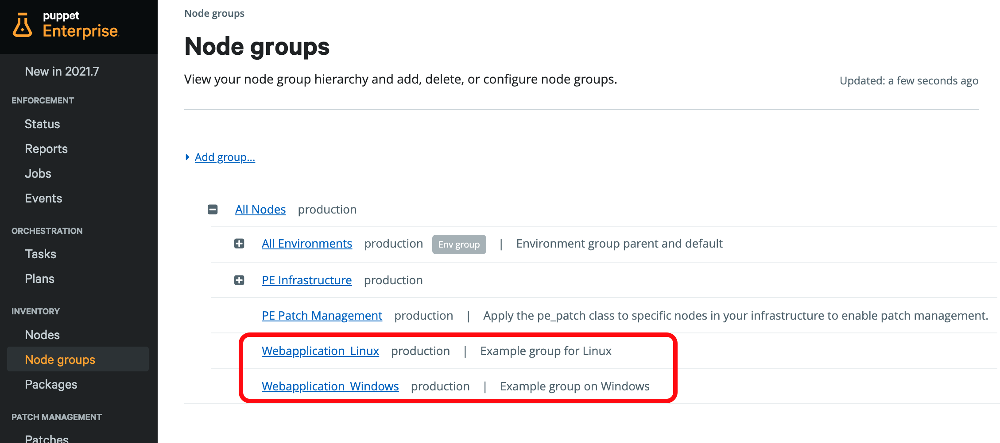
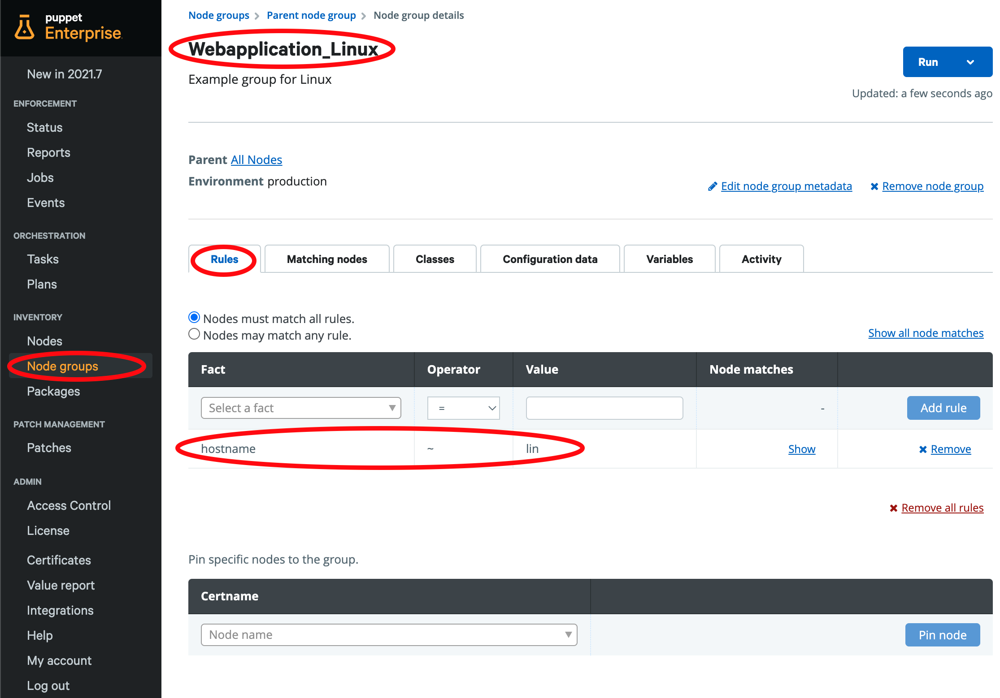
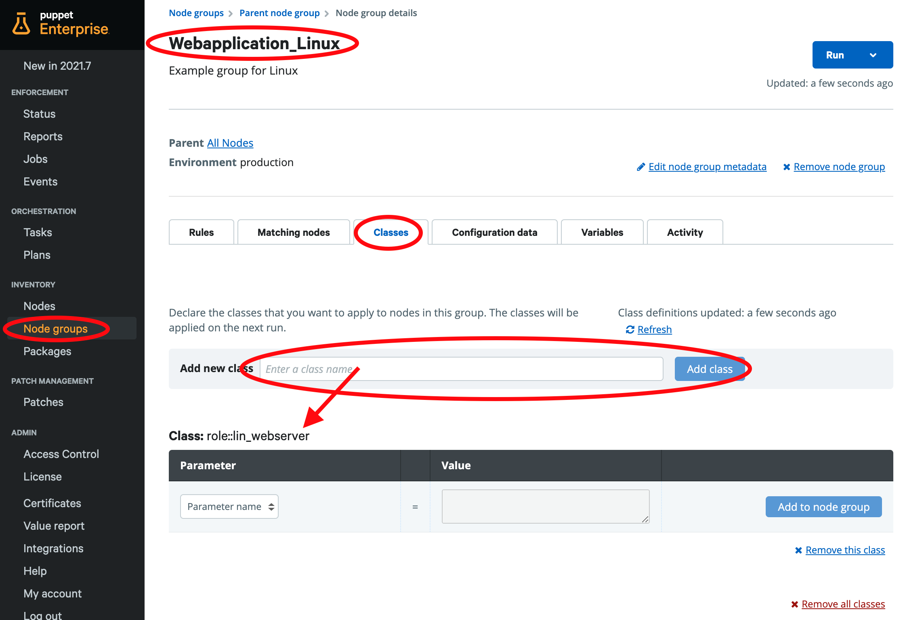

# (101) Roles and Profiles

__Let's run through an example configuration of Roles and Profiles with Puppet. The following example is taken from [puppet-enterprise-guide.com](https://puppet-enterprise-guide.com/theory/roles-and-profiles-overview.html) that previsously has been written by colleagues at Puppet. But it is theory as long as there is no Puppet instance to try it. Well - here is one!__

__Time to execute__: approx. 2 hours (depending on performance)

---
## Synopsis

Initially I did not plan to add anything here that is available couple of hundered times in the internet already. But as it turns out that a running example is always more appealing to people than a pretty theory. And even when we all agree that this is a very easy example to do - than this is even more a reason to simply provide this example. For Puppet novices it is sometimes confusing to understand what exactly is going wrong when there is an error. So this running example guarantees a working starting point from where more tests and learnings can happen onwards.

In the following we spin up a Puppet environment by running through the [(2) Code Manager tutorial](https://github.com/mrcmn/puppet-upandrun/blob/main/tutorials/capabilities/02-codemanager-config.md) and without the Cleanup in the end of that tutorial, we proceed here.

__Note__: We will work with four VMs here, so you need some resources (RAM and CPU) to be available on your laptop.

---
## Prepare the environment

If you don't already have an environment with Gitlab instance, then use the following [(2) Code Manager tutorial](https://github.com/mrcmn/puppet-upandrun/blob/main/tutorials/capabilities/02-codemanager-config.md). Don't destroy the environment in the end, but come back here to run through the roles and profiles example below.

---
## Roles and Profiles

1. [Overview about the example](#1-overview)
2. [Create Profiles](#2-create-the-profiles)
3. [Create Roles](#3-create-the-roles)
4. [Classify your example and see the results](#4-classify-the-example)

### 1. Overview

If you have already the primary.vm and the gitlab.vm running, then you need to spin up the linux.vm and the windows.vm but running these commands:

```
vagrant up linux.vm
vagrant up windows.vm
```

Give both machines some time to connect to Puppet Enterprise and be visible in the Status page of the Console.

After that we have four machines running and ready for the following. We are going to install an Apache driven "Hello World" webpage on Linux and an IIS driven one on the Windows machine.

This is the structure we are going to create. If you want to know the theory behind it, please refer to the [Puppet Enterprise Guide](https://puppet-enterprise-guide.com/theory/roles-and-profiles-overview.html) or the official documentation ([see below](#additional-information)). 

```
Role lin_webserver.pp     - a role that has everything for the webserver on Linux
└── profiles
    ├── apache.pp         - the apache webserver
    ├── lin_firewall.pp   - firewall settings
    └── lin_webpage.pp    - the example web application

Role win_webserver.pp     - a role that has everything for the webserver on Windows
└── profiles
    ├── iis.pp
    ├── win_firewall.pp
    └── win_webpage.pp
```

First we create all needed six profiles, after that we create the two roles. And then we run it.

Make sure you are here, then you can run through the below by just copy&paste the command blocks to the primary.vm:

```
[root@primary control-repo]# pwd
/root/repo/control-repo
[root@primary control-repo]#
```

### 2. Create the Profiles

First we have to update the Puppetfile to make the modules from the forge available here:

```
cat <<EOF >> Puppetfile
mod 'puppetlabs-firewall',                    :latest
mod 'puppetlabs-apache',                      :latest
mod 'puppetlabs-stdlib',                      :latest

mod 'puppetlabs-pwshlib',                     :latest
mod 'puppetlabs-registry',                    :latest
mod 'puppetlabs-iis',                         :latest
mod 'puppet-windows_firewall',                :latest

mod 'puppetlabs/concat',                      :latest
EOF
```

Create the apache profile:

```
cat <<EOF > site-modules/profile/manifests/apache.pp
# Profile to install a basic apache webserver
class profile::apache {
    class { 'apache':}
}
EOF
```
Create the iis profile:

```
cat <<EOF > site-modules/profile/manifests/iis.pp
# Profile to install a basic IIS webserver
class profile::iis {
  $iis_features = ['Web-WebServer','Web-Scripting-Tools']

     iis_feature { $iis_features:
       ensure => 'present',
     }
}
EOF
```

Create the firewall settings for Linux. Firewall is probably not needed here in the local environment. But still a good example.

```
cat <<EOF > site-modules/profile/manifests/lin_firewall.pp
# Profile to open ports for HTTP/HTTPS access
class profile::lin_firewall {

  firewall { '100 allow http and https access':
    dport  => [80, 443],
    proto  => 'tcp',
    action => 'accept',
  }
}
EOF
```

Create the firewall settings for Windows.

```
cat <<EOF > site-modules/profile/manifests/win_firewall.pp
class profile::win_firewall {

  class { 'windows_firewall':
    ensure => 'running',
  }

  windows_firewall::exception { 'HTTP/HTTPS':
    ensure       => present,
    direction    => 'in',
    action       => 'allow',
    enabled      => true,
    protocol     => 'TCP',
    local_port   => '80,443',
    remote_port  => 'any',
    display_name => 'IIS Webserver access HTTP/HTTPS',
    description  => 'Puppet Inbound rule for an IIS Webserver via HTTP/HTTPS [TCP 80,443]',
  }
}
EOF
```

Finally we want a webpage. Let it be a "Hello World" at this point.

```
cat <<EOF > site-modules/profile/manifests/lin_webpage.pp
# Profile to add custom webserver content
class profile::lin_webpage {

  file { '/var/www/html/index.html':
    ensure  => file,
    content => "Hello Puppet World!",
  }
}
EOF
```

```
cat <<EOF > site-modules/profile/manifests/win_webpage.pp
# Profile to add custom webserver content
class profile::win_webpage {

  file { 'C:\Inetpub\wwwroot\index.html':
    ensure  => file,
    content => "Hello Puppet World!",
  }
}
EOF
```

### 3. Create the Roles

The roles now combine several profiles together. Usually they just contain include statements.

```
cat <<EOF > site-modules/role/manifests/lin_webserver.pp
class role::lin_webserver {
  include profile::lin_firewall
  include profile::apache
  include profile::lin_webpage
}
EOF
```

```
cat <<EOF > site-modules/role/manifests/win_webserver.pp
class role::win_webserver {
  include profile::win_firewall
  include profile::iis
  include profile::win_webpage
}
EOF
```

Now we have all files created. We need to push the changes to the control-repo on the gitlab.vm:

```
eval `ssh-agent -s`
ssh-add /etc/puppetlabs/puppetserver/ssh/id-control_repo.rsa
```

And then:

```
[root@primary control-repo]# git add .
[root@primary control-repo]# git commit -m "added webpages"
[root@primary control-repo]# git push origin production
```

After few moments you should be able to see both roles `role::win_webserver` and `role::lin_webserver` selectable in the classes field of the Node Group configuration page.

### 4. Classify the example

As we now have all definitions made and all four VMs are running and windows.vm and linux.vm are available in Puppet Enterprise, we can do the last step to classify the nodes. Go to the Node Groups page and create two Node Groups `Webapplication_Linux` and `Webapplication_Windows`:



In the Webapplication_Linux group __add__ the following rule to include the linux.vm:



__Add__ the role to this group in the Classes tab:



Do the same for the Webapplication_Windows group, but of course with `hostname ~ win` in the Rules and `role::win_webserver` in the Classes tab.

Commit all changes in the Console UI if not done already. If you haven't done the following before, you need to run this only once:

```
[root@primary control-repo]# puppet access login --lifetime 360d
Enter your Puppet Enterprise credentials.
Username: admin
Password: puppetlabs

Access token saved to: /root/.puppetlabs/token
[root@primary control-repo]#
```

Then you can trigger an agent run on all agents:

```
puppet job run --no-enforce-environment --query 'nodes {deactivated is null and expired is null}'
```

See the webpage on the Linux server: 

[http://192.168.50.6/](http://192.168.50.6/)

And on the Windows server:

[http://192.168.50.5/](http://192.168.50.5/)

Done!

---
## Summary

Verified:

* Created a basic Roles and Profiles structure.
* Applied the Roles to Node Groups.
* Checked for the "Hello World" application on both servers: linux.vm and windows.vm!

---
## Additional information

- [Puppet Documentation](https://www.puppet.com/docs/pe/latest/)
- [The roles and profiles method](https://www.puppet.com/docs/puppet/7/the_roles_and_profiles_method.html)
- [Puppet Enterprise Guide](https://puppet-enterprise-guide.com/)

---
## Cleanup

You can now do more things with this environment or halt this environment (shut down) if you want to use it again in the future. Or delete this environment after you finished any additional testings.
